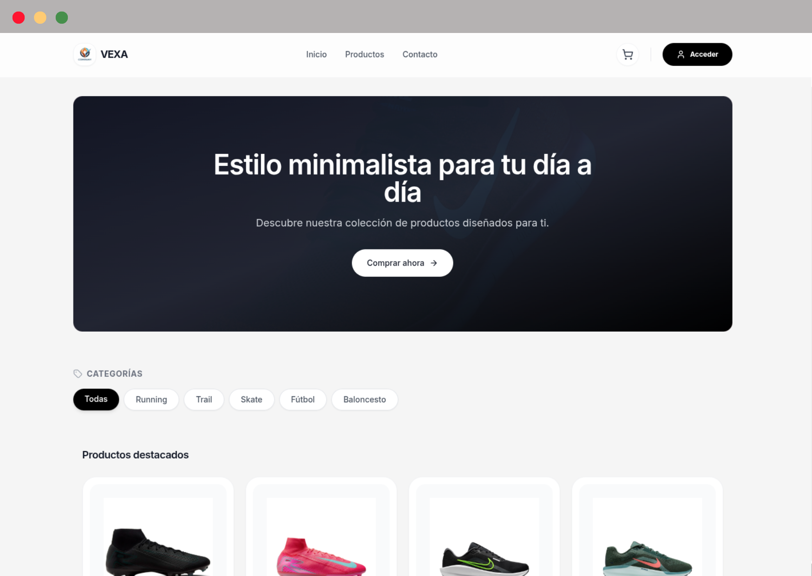

# VEXA E-Commerce Frontend


> ⚠️ **Nota:** Este proyecto se encuentra actualmente en **fase de desarrollo activo**. Algunas funcionalidades pueden estar en proceso de implementación.

**E-commerce moderno de alto rendimiento** con arquitectura modular y experiencia de usuario optimizada.

**[Live Demo](https://e-commerce-frontend-mu-five.vercel.app/)** | **[Backend](https://github.com/ayoubMO19/e-commerce-backend)**

---

---

## 🏗️ Arquitectura

VEXA implementa una arquitectura modular basada en **React + TypeScript** con separación clara de responsabilidades:

- **Hooks personalizados**: Lógica de negocio encapsulada (`useAuth`, `useCart`, `useProductsData`)
- **Servicios centralizados**: Cliente Axios con interceptores y gestión de errores
- **Context API**: Estado global para autenticación y carrito de compras
- **Lazy Loading**: Carga diferida de componentes para optimizar performance
- **Type Safety**: Tipado completo basado en DTOs del backend

## 🛠️ Stack Tecnológico

- **React 19.2.0** - UI Library con hooks modernos
- **TypeScript 5.9** - Tipado estático y desarrollo robusto
- **Vite 7.2** - Build tool ultra-rápido
- **TailwindCSS 3.4** - Framework CSS utility-first
- **TanStack Query 5.90** - Manejo de estado asíncrono
- **Axios 1.13** - Cliente HTTP con interceptores
- **React Router 7.12** - Routing declarativo
- **Lucide React** - Iconos modernos
- **Sonner** - Sistema de notificaciones

## ✨ Características Clave

- **🔐 Sistema de autenticación JWT** con persistencia y refresh automático
- **🛒 Gestión de carrito persistente** con sincronización local y remota
- **📱 Diseño 100% responsive** con TailwindCSS
- **⚡ Lazy loading** y code splitting automático
- **🎯 Manejo de errores tipado** con TypeScript
- **🔔 Sistema de notificaciones** integrado
- **🚀 Performance optimizada** con Vite

## 📁 Estructura del Proyecto

```
src/
├── app/
│   ├── router/          # Sistema de rutas con lazy loading
│   ├── providers/       # Proveedores de contexto
│   └── store/           # Estado global
├── components/          # Componentes reutilizables
├── context/            # Context API (Auth, Cart)
├── hooks/              # Hooks personalizados
├── layout/             # Layouts principales
├── pages/              # Páginas de la aplicación
├── services/           # Servicios de API
├── types/              # Tipos TypeScript
└── utils/              # Utilidades comunes
```

## 🚀 Guía de Inicio Rápido

### Prerrequisitos
- Node.js 18+
- npm o yarn

### Instalación

1. **Clonar el repositorio**
   ```bash
   git clone https://github.com/ayoubMO19/e-commerce-frontend.git
   cd e-commerce-frontend
   ```

2. **Instalar dependencias**
   ```bash
   npm install
   ```

3. **Configurar variables de entorno**
   ```bash
   cp .env.example .env.local
   ```

4. **Iniciar servidor de desarrollo**
   ```bash
   npm run dev
   ```

5. **Abrir navegador** en `http://localhost:5173`

### Scripts disponibles

```bash
npm run dev      # Servidor de desarrollo
npm run build    # Build para producción
npm run preview  # Preview del build
npm run lint     # Linting con ESLint
```

## 🎯 Performance

VEXA alcanza un **Real Experience Score de 100/100** en Vercel Speed Insights gracias a:

- Lazy loading de componentes
- Optimización de bundle con Vite
- Imágenes optimizadas
- Mínimo JavaScript crítico
- CSS utility-first con Tailwind

## 🔧 Configuración

### Estado de la API
Actualmente, el frontend está configurado para conectar directamente con la instancia de producción en Render. 

> **Próximamente:** Implementación de variables de entorno (`.env`) para facilitar el cambio entre entornos de desarrollo y producción.

### API Endpoints

El frontend se conecta al backend Spring Boot a través de:

- **Autenticación**: `/api/auth/*`
- **Productos**: `/api/products/*`
- **Categorías**: `/api/categories/*`
- **Carrito**: `/api/cart/*`
- **Usuarios**: `/api/users/*`

## 🤝 Contribución

1. Fork del proyecto
2. Feature branch (`git checkout -b feature/amazing-feature`)
3. Commit (`git commit -m 'Add amazing feature'`)
4. Push (`git push origin feature/amazing-feature`)
5. Pull Request

## 🗺️ Roadmap (Próximamente)

- [ ] Implementación de Variables de Entorno (`.env`)
- [ ] Integración de pasarela de pago real (Stripe/PayPal)
- [ ] Panel de Administración para gestión de stock
- [ ] Optimización avanzada de imágenes con Cloudinary

## 📄 Licencia

MIT License - ver archivo [LICENSE](LICENSE) para detalles.

---

**Desarrollado con el fin de mejorar mis habilidades y conocimientos en el ecosistema de React + TypeScript, aplicando las mejores prácticas.**
