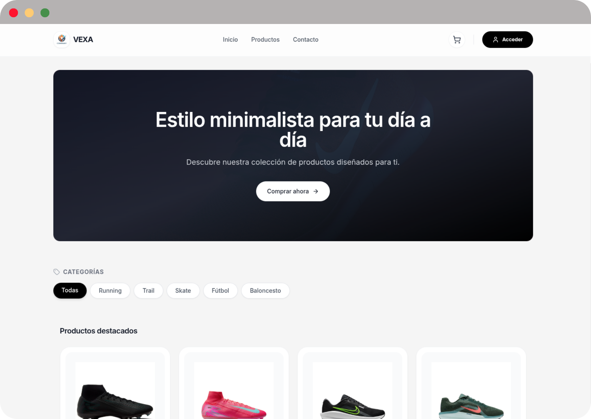

# VEXA E-Commerce Frontend

<div align="center">


</div>

**VEXA** es un e-commerce moderno de alto rendimiento construido con un stack tecnológico moderno, enfocado en la escalabilidad, la seguridad en los pagos y una experiencia de usuario fluida.

**[Live Demo](https://e-commerce-frontend-mu-five.vercel.app/)** | **[Backend Repository](https://github.com/ayoubMO19/e-commerce-backend)**

---

<div align="center">
  
</div>

---

## 🛠️ Stack Tecnológico

- **Frontend Core**: React 19 & TypeScript 5.9
- **Build Tool**: Vite 7.2 (Optimizado para desarrollo rápido)
- **Estilos**: TailwindCSS 3.4
- **Estado Asíncrono**: TanStack Query v5 (Caching y Server State)
- **Pagos**: Stripe SDK & Elements
- **Comunicación**: Axios con Interceptores
- **Navegación**: React Router 7
- **UI/UX**: Lucide React & Sonner (Notificaciones)

## ✨ Características Clave

- **🔐 Autenticación Robusta**: Sistema JWT con persistencia de sesión y protección de rutas.
- **💳 Pasarela de Pagos Segura**: Integración completa con **Stripe Elements** para el procesamiento de transacciones.
- **📍 Smart Address Autocomplete**: Buscador de direcciones inteligente mediante la API de Photon/OpenStreetMap con filtrado geográfico.
- **🛒 Gestión de Carrito**: Sincronización en tiempo real entre el estado local y el backend.
- **⚡ Performance Optimizada**: Puntuación de 100/100 en Core Web Vitals gracias a Lazy Loading y code-splitting.
- **📱 Responsive Design**: Interfaz minimalista adaptable a cualquier dispositivo móvil o desktop.

## 💳 Checkout & Pagos (Stripe Sandbox)

El sistema de pagos está implementado bajo los estándares de **PCI Compliance** (los datos sensibles nunca tocan nuestro servidor).

- **Gestión Asíncrona**: Uso de Payment Intents para asegurar la integridad de cada cobro.
- **Datos para Pruebas**: 
  - **Tarjeta**: `4242 4242 4242 4242`
  - **CVC**: Aleatorio | **Fecha**: Cualquiera futura.

## 🏗️ Arquitectura y Buenas Prácticas

VEXA implementa una arquitectura modular diseñada para el mantenimiento a largo plazo:

- **Custom Hooks**: Lógica de negocio desacoplada de los componentes (`useAuth`, `useCart`, `useStripePayment`).
- **Data Fetching**: Gestión eficiente de estados asíncronos y caché con **TanStack Query**.
- **Type Safety**: Tipado estático riguroso en toda la aplicación para minimizar errores en runtime.
- **Resilient UI**: Sistema diseñado para manejar fallos de APIs externas de forma elegante (Graceful Degradation).

## 🚀 Guía de Inicio Rápido

### Prerrequisitos
- Node.js 18+
- npm o yarn

### Instalación

1. **Clonar y acceder**
   ```bash
   git clone https://github.com/ayoubMO19/e-commerce-frontend.git
   cd e-commerce-frontend
   
2. **Instalar dependencias**
   ```bash
   npm install
   ```

3. **Configurar variables de entorno**
   ```bash
   cp .env.example .env
   ```

4. **Iniciar servidor de desarrollo**
   ```bash
   npm run dev
   ```

5. **Abrir navegador** en `http://localhost:5173`

### Scripts disponibles

```bash
npm run dev      # Servidor de desarrollo
npm run build    # Build para producción
npm run preview  # Preview del build
npm run lint     # Linting con ESLint
```

## 🎯 Performance

VEXA alcanza un **Real Experience Score de 100/100** en Vercel Speed Insights gracias a:

- Lazy loading de componentes
- Optimización de bundle con Vite
- Imágenes optimizadas
- Mínimo JavaScript crítico
- CSS utility-first con Tailwind

## 🔧 Configuración

### Estado de la API
Actualmente, el frontend está configurado para conectar directamente con la instancia de producción en Render. 
Como se puede ver en el archivo `.env`:
```bash
VITE_API_BASE_URL="Tu URL de la API"
```

### API Endpoints

El frontend se conecta al backend Spring Boot a través de:

- **Autenticación**: `/api/auth/*`
- **Productos**: `/api/products/*`
- **Categorías**: `/api/categories/*`
- **Carrito**: `/api/cart/*`
- **Usuarios**: `/api/users/*`

## 🤝 Contribución

1. Fork del proyecto
2. Feature branch (`git checkout -b feature/amazing-feature`)
3. Commit (`git commit -m 'Add amazing feature'`)
4. Push (`git push origin feature/amazing-feature`)
5. Pull Request

## 🗺️ Roadmap (Próximamente)

- [x] Integración de Stripe (Modo Test)
- [ ] Implementación de Webhooks para confirmación de pedidos
- [ ] Panel de Administración para gestión de inventario
- [ ] Generación de facturas dinámicas en PDF

## 📄 Licencia

MIT License - ver archivo [LICENSE](LICENSE) para detalles.

---

**Desarrollado con enfoque en calidad técnica y mejores prácticas por [Ayoub Morghi Ouhda](https://www.linkedin.com/in/ayoub-morghi-ouhda/)**
