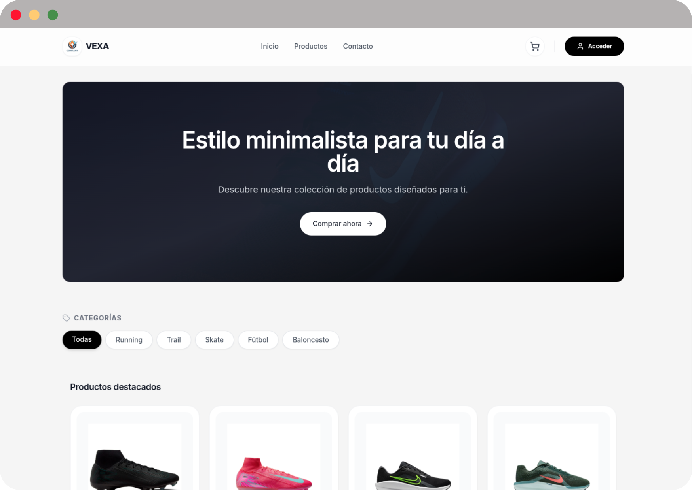

# VEXA E-Commerce Frontend

<div align="center">


</div>

Modern, high-performance e-commerce frontend built with a production-ready tech stack, focused on scalability, secure payments, and a seamless user experience.

👉 **[Live Demo](https://e-commerce-frontend-mu-five.vercel.app/)** | 🖥️ **[Backend Repository](https://github.com/ayoubMO19/e-commerce-backend)**

---

<div align="center">
  
</div>

---

## 🚀 Tech Stack

* React 19
* TypeScript 5.9
* Vite 7.2 (Optimized build tool)
* TailwindCSS 3.4
* TanStack Query v5 (Server state & caching)
* Stripe SDK & Elements
* Axios (with Interceptors)
* React Router 7
* Lucide React & Sonner (UI/UX)

---

## ✨ Key Features

### Authentication & Core

* **Secure Auth Flow:** JWT-based system with session persistence and protected client-side routing.
* **Real-time Cart Management:** Seamless synchronization between local state and backend databases.
* **Responsive Layout:** Minimalist design fully adapted for mobile, tablet, and desktop viewports.

### Advanced Integrations

* **PCI-Compliant Checkout:** Full integration with **Stripe Elements** ensuring sensitive card details never touch our servers.
* **Smart Address Autocomplete:** Geographically-filtered intelligent address lookup powered by Photon/OpenStreetMap API.
* **Performance-First Engine:** Achieved a **100/100 Real Experience Score** on Vercel Speed Insights via lazy loading and code-splitting.

---

## 🏗️ Architecture & Best Practices

The project implements a clean, modular frontend architecture designed for long-term maintainability:

* **Decoupled Logic:** Pure business logic is isolated into custom React hooks (`useAuth`, `useCart`, `useStripePayment`).
* **Efficient Data Fetching:** Asynchronous states and API caching are completely managed via **TanStack Query**.
* **Strict Type Safety:** Rigorous static typing across all components to eliminate runtime errors.
* **Resilient UI:** Graceful degradation patterns implemented to handle external API failures smoothly.

---

## 💳 Testing Payments (Stripe Sandbox)

The payment flow handles transactions asynchronously using Payment Intents to secure financial integrity.

* **Test Card:** `4242 4242 4242 4242`
* **CVC:** Any random 3 digits | **Expiry:** Any future date.

---

## ▶️ Quick Start

### Prerequisites

* Node.js 18+
* npm / yarn

### Installation

1. **Clone the repository:**
   ```bash
   git clone [https://github.com/ayoubMO19/e-commerce-frontend.git](https://github.com/ayoubMO19/e-commerce-frontend.git)
   cd e-commerce-frontend
   ```

2. **Install dependencies:**
   ```bash
   npm install
   ```

3. **Set up environment variables:**
   ```bash
   cp .env.example .env
   ```
   *Configure your `VITE_API_BASE_URL` inside the `.env` file.*

4. **Run the development server:**
   ```bash
   npm run dev
   ```

---

## 👨‍💻 Author

**Ayoub Morghi Ouhda**

Full Stack Developer | Node.js · TypeScript · React · Java · SQL/NoSQL
